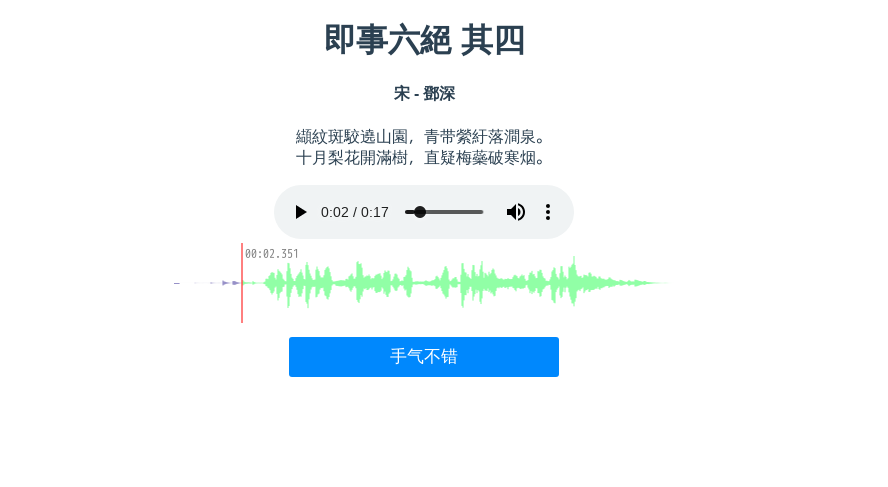
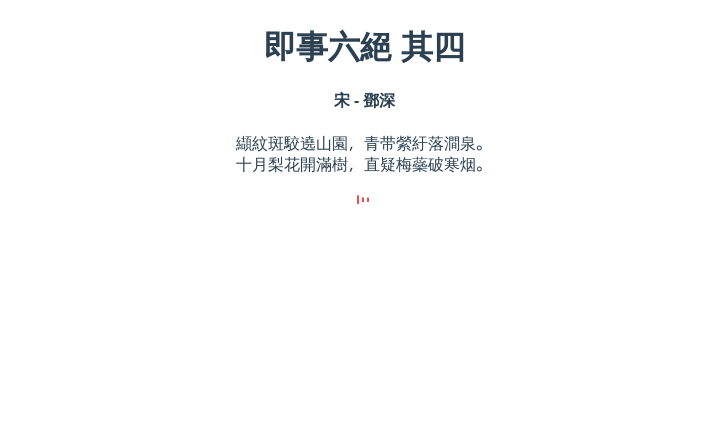

# Poetryboy(诗童)
诗童是一个人随机挑选一首唐诗宋词，配上背景音乐朗读。

#### 技术架构
- 后端: [Django](https://www.djangoproject.com/)
- 前端: [Vue](https://cn.vuejs.org/index.html)
- TTS引擎：[讯飞在线语音合成](https://www.xfyun.cn/services/online_tts)
- 无版权背景音乐获取: [musopen](https://.org/music/)
#### 原生启动项目
###### 后端
- 后端
```
cd src/
./manager.py runserver
```

- 访问后端管理添加申请的讯飞语音合成AppID与AppSecret
访问 http://localhost:8000/admin
```
默认用户名密码
admin
admin123
```

- 前端
```
cd /ui
npm run serve
```
访问 http://localhost:8080

#### docker快捷启动
```
sudo ./buildDocker.sh
docker-compose up
```
#### 示例
- 示例1

- 示例2
